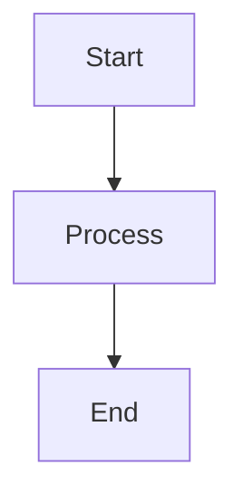
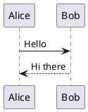

# Confluence - Documentation Management

## Overview
Manage Confluence documentation with Markdown/Wiki Markup conversion, diagram embedding, and page management via Atlassian MCP.

## Prerequisites

### Atlassian MCP Setup
```bash
# Install Atlassian MCP
claude mcp add atlassian --transport sse "https://mcp.atlassian.com/v1/sse" --scope user
```

### Alternative: Advanced Confluence Skill
For enhanced features (Mermaid diagrams, Git sync), install:
```bash
# Using skilz CLI
pip install skilz
skilz install SpillwaveSolutions_mastering-confluence-agent-skill/mastering-confluence
```

## Core Capabilities

| Capability | Description |
|------------|-------------|
| Create Pages | New pages in any space |
| Update Pages | Edit existing content |
| Search | CQL (Confluence Query Language) |
| Attachments | Upload images, files |
| Diagrams | Embed Mermaid, PlantUML |

## Diagram Types Supported

### 1. Mermaid Diagrams

Embed using `{mermaid}` macro in Confluence.

### 2. PlantUML


### 3. Draw.io Embedded
- Create diagram in draw.io
- Export as PNG with embedded XML
- Upload as attachment
- Embed via `{drawio}` macro

## Wiki Markup Basics

| Markdown | Wiki Markup |
|----------|-------------|
| `# Heading` | h1. Heading |
| `## Heading` | h2. Heading |
| `**bold**` | *bold* |
| `*italic*` | _italic_ |
| `[link](url)` | [link|url] |
| `` | !image.jpg! |
| `- item` | * item |
| `1. item` | # item |

## CQL Examples

```bash
# Search pages in a space
siteSearch ~ "keyword"

# Pages modified recently
type=page AND lastModified > "-7d"

# Pages by title
type=page AND title ~ "API"
```

## Best Practices for PMs

1. **Use consistent structure** - Standard headers, toc macro
2. **Embed diagrams** - Mermaid for code, draw.io for complex visuals
3. **Add metadata** - Labels, restrictions
4. **Link related pages** - Cross-link for navigation
5. **Use templates** - Create reusable page templates

## Common PM Use Cases

- Product requirement documents (PRDs)
- Technical specifications
- Team documentation
- Meeting notes & decisions
- API documentation
- Runbooks & playbooks
