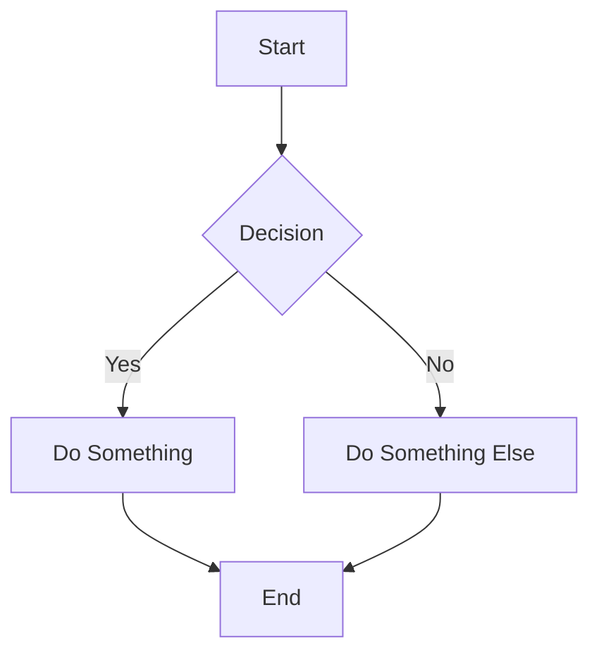
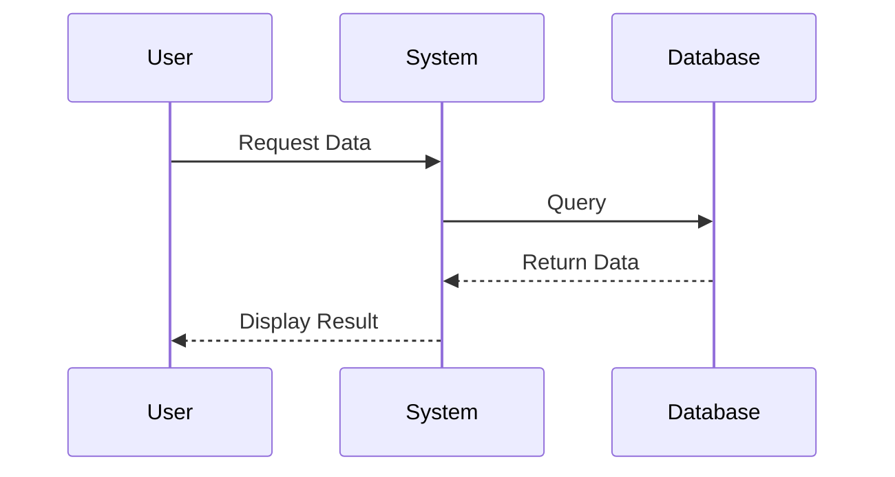
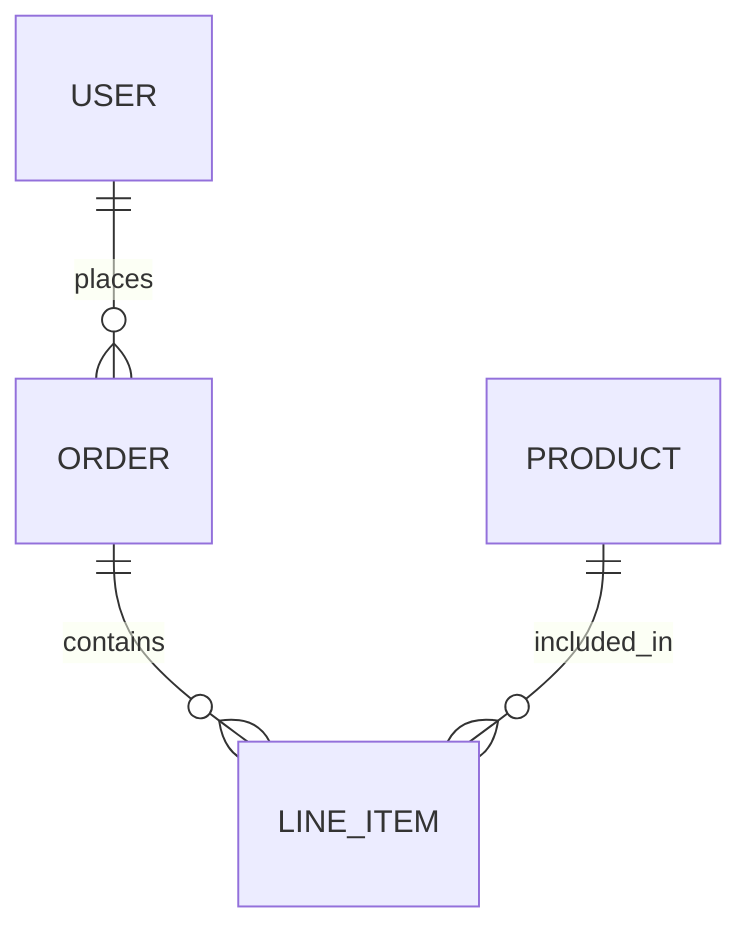
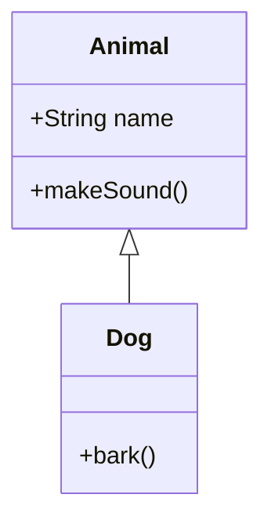
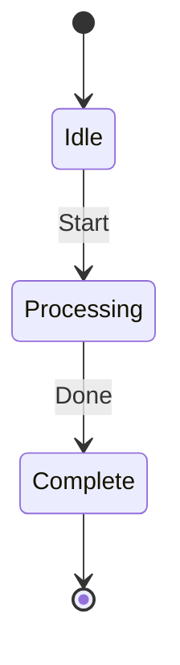
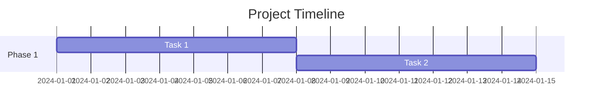
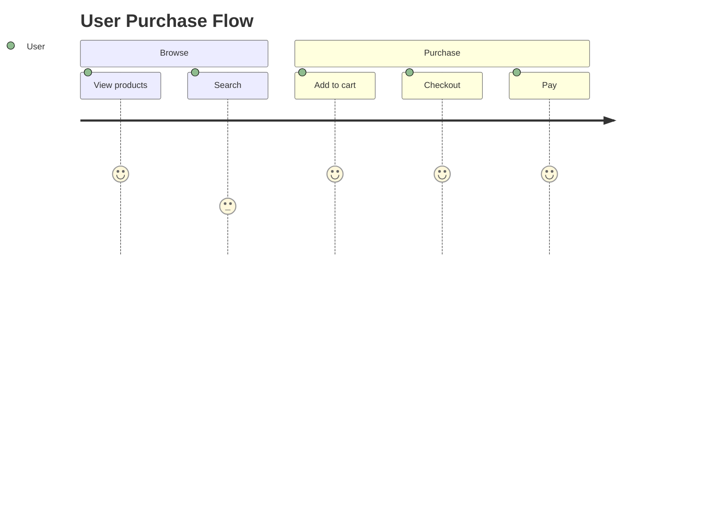

# Diagrams - Code-Based Visualization

## Overview
Create professional diagrams from text descriptions. Great for documentation, READMEs, and quick visualizations.

## Tools

### Mermaid (Recommended)
Live editor: https://mermaid.live

Syntax directly in markdown - renders in many markdown viewers.

### PlantUML
More powerful, requires rendering server or local tool.

### Draw.io / Diagrams.net
For more complex diagrams, can export to various formats.

## Diagram Types

### 1. Flowchart

### 2. Sequence Diagram

### 3. ER Diagram

### 4. Class Diagram

### 5. State Diagram

### 6. Gantt Chart

### 7. User Journey

## PM Use Cases

| Use Case | Diagram Type |
|----------|--------------|
| User flows | Flowchart, Sequence |
| System architecture | Flowchart, ERD |
| Data models | ERD, Class |
| Project timelines | Gantt |
| Process maps | Flowchart, State |
| User journeys | Journey |

## Tips
- Keep diagrams simple and focused
- Use clear labels
- Choose right diagram type for the message
- Test in mermaid.live before embedding

## Rendering
- GitHub/GitLab: Native Mermaid support
- VS Code: Mermaid preview extension
- Websites: Use mermaid.js library
